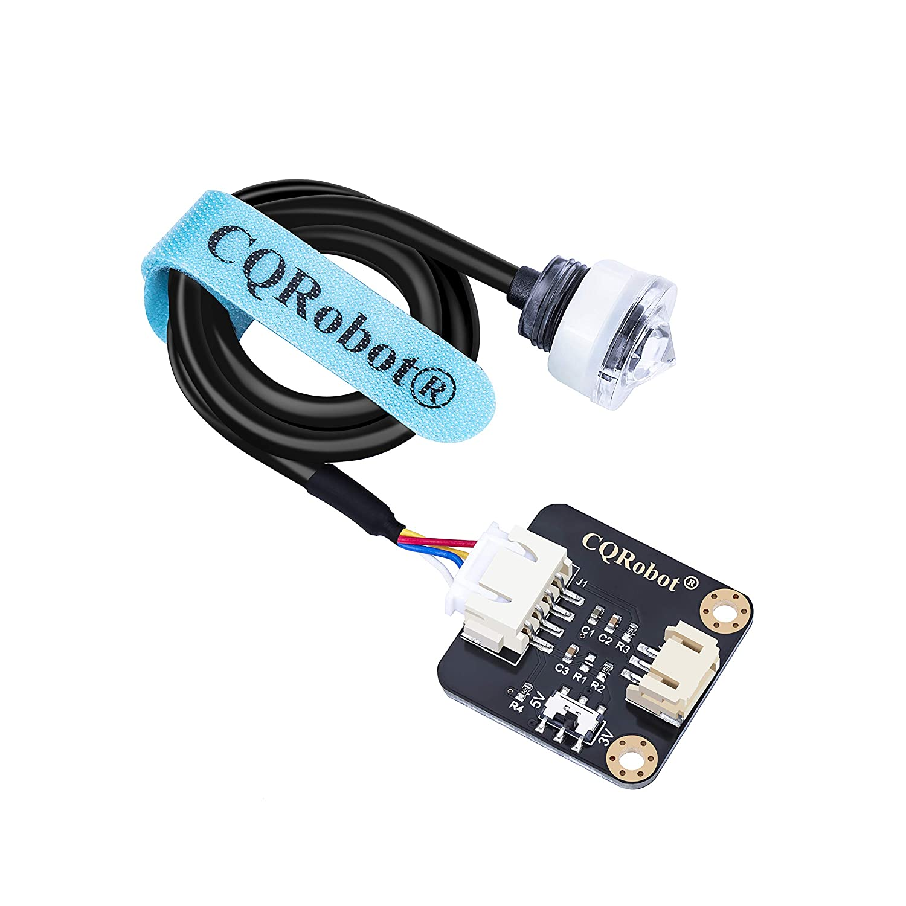

# Adding a Level Sensor to your Barrel
One optional feature is to install a water level detector on the water barrel. This allows such possibilities as: 
* automatically topping up the barrel if the level gets low
* Checking if it has rained between given times

## Parts

* CQ Robot Watel level contact sensor

## Important Steps

### Connecting Sensor to Raspberry Pi

Using a CQRobot water level contact sensor:
* Attach GND to any ground pin
* Attach VCC to any 5V pin
* Attach OUT to any GPIO pin

### Writing Python Code to Read Sensor
You can use RobotanyLevel.py - it is ready to go, or you can write your own.
At a minimum, the script should contain these commands (in this example I used pin 8):

Set up the pin:
* level_pin_number = 8
* import RPi.GPIO as GPIO
* GPIO.setmode(GPIO.BOARD)
* GPIO.setup(level_pin_number, GPIO.IN)

To read in the value:
* GPIO.input(level_pin_number)

