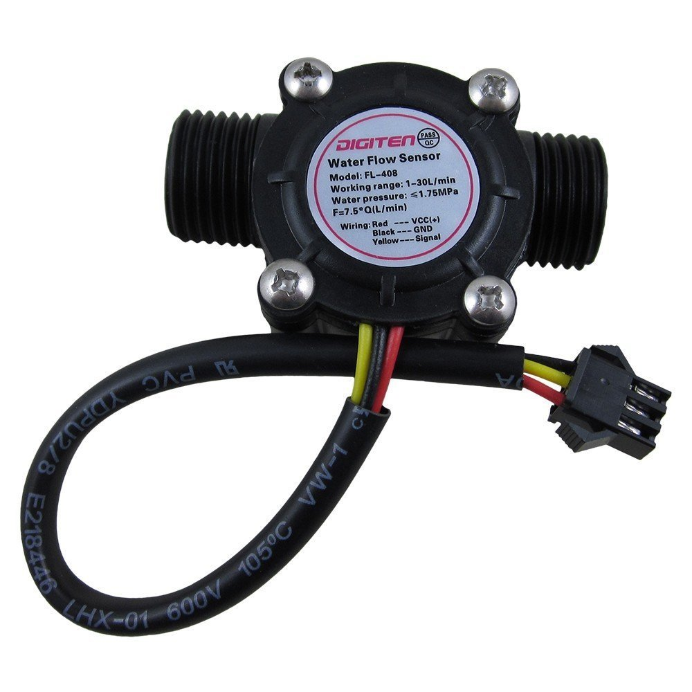

[Return to Readme](README.md)
# Adding a Flow Sensor to the System

This will allow you to measure water usage in the system. For my part, I am measuring the amount of water from the mains used to top off my water barrels when they get low.

## Parts

* Digiten G1/2" Hall Sensor Water Counter 1-30 L/min

## Important Steps
TBD

[Return to Readme](README.md)
