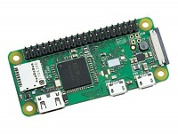
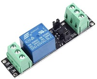
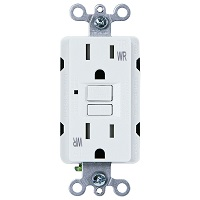

# Robotany
Automated Gardening System

## Parts

* Raspberry Pi Zero W

* SRD-03VDC-SL-C 3V relay board or equivalent

* 12V solenoid water valve

* Water hammer arrestor

* 12V Power supply

* Length of cable suitable for carrying 12V from where the pi will be located to the solendoid valve

* Weather resistant mains power outlet with at least two outlets

* Wall box for power outlet above 

* Mains cable and plug suitable for use outdoors

* Outdoor weatherproof Enclosure

* Fittings to connect solenoid valve and water hammer arrestor to your garden faucet and hospipe.

## Important steps

### Install Raspian onto SD Card
1. Dowload Raspberry Pi Imager from https://www.raspberrypi.org/downloads/
2. Launch Raspberry Pi Imager and follow instructions to install Raspian on an SD card

### Set up Raspberry Pi Zero W
Install SD card with Raspian into Pi, connect mouse, keyboard and monitor and power. Follow instructions to select language, keyboard layout and timezone.

### Set Static IP Address
Note: I still haven't got this to work yet, Was folllowing a combination of instructions from these two links:
https://www.raspberrypi.org/forums/viewtopic.php?p=1500626
https://howtoraspberrypi.com/how-to-raspberry-pi-headless-setup/

### Enable VNC server
1. Open command prompt
2. Type **sudo raspi-config**
3. Go to "Interfacing Options" then "VNC" and select the option to enable the VNC server.
4. Exit the configuration menu

### Connect to VNC Server
1. Obtain IP address from Raspberry Pi by typing **ifconfig wlan0** (or **ifconfig eth0** if connected to the network via ethernet).
2. Install a VNC client on your other device and use the IP address from above, username and password. (Default username = pi, password = raspberry). A VNC viewer can be dowloaded from here: https://www.realvnc.com/en/connect/download/viewer/

### Decide which pins to use
Type **pinout** in a terminal window to get a handy diagram. You'll need:
* A 3.3V pin
* A ground pin
* Any other GPIO pin for the signal to the relay

Read https://www.raspberrypi.org/documentation/usage/gpio for more information about pins.

### Hook Up Cables on Bench
_Make sure everything is powered down including 12V power supply before doing this step!_

3.3V pin on Pi goes to VCC terminal on relay board
Ground pin on Pi goes to GND terminal on relay board
GPIO pin on Pi goes to VCC terminal on relay board

Ground wire from 12V power supply gets connected to return wire of 12V cable to solenoid.
Live wire from 12V power supply goes to COM terminal on relay board.
Live wire from 12V cable to solenoid goes to NO terminal on relay board.

Diagram to follow. Refer to https://www.circuitbasics.com/setting-up-a-5V-relay-on-the-arduino/ for a rough idea.

### Write/Install Python Code to Control Relay
At a minimum it should contain these commands (I used pin 8):

Set up the pin:
* import RPi.GPIO as GPIO
* GPIO.setmode(GPIO.BOARD)
* GPIO.setup(8, GPIO.OUT)

Turn pin on and off:
* GPIO.output(8, True)
* GPIO.output(8, False)

### Install Everything in Project Box
Once you have tested everything and you are satisfied, you can install everything in the project box for real.

1) Drill two holes in the bottom side of the box, one for the mains power cable and one for the 12V cable.
2) Install power socket into project box an connect it up with cable through the hole you just drilled, and plug suitable for outdoors. Be sure to arrange it in the box such that the 12V power supply and Raspberry Pi power supply will fit when plugged in and the box lid is closed.
3) Lay out the Raspberry Pi Zero and relay and attach to box.
4) Feed the 12V cable through the second hole so it can later be attached to the solenoid valve.
5) Finish reconnecting any remaining wires.
6) Seal up the holes in the project box using grommets if you are fancy, or silicone sealant if you are not.
7) Mount box to wall and close
8) Fit solenoind valve and water hammer arrestor directly downsteam of it.

### Set up Pi to Run Script on Bootup
Haven't figured out how to do this yet.
